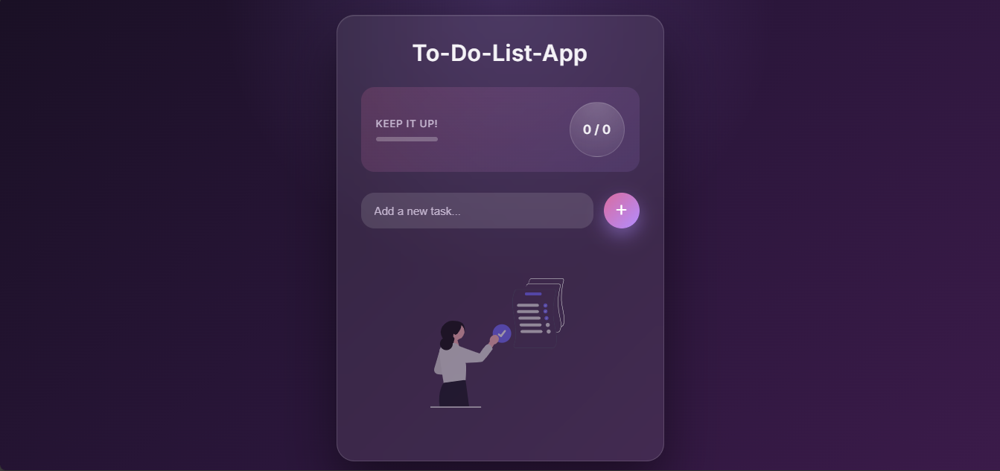

# 📝 To-Do List App

A modern, responsive To-Do List application built with **HTML, CSS, and Vanilla JavaScript**.

## ✨ Features:
- Add, edit, and delete tasks
- Task completion tracking
- Progress bar with completion percentage
- Persistent data using Local Storage
- Elegant empty-state UI
- Confetti celebration on full completion 🎉

## 🎨 UI & Design:
- Modern pink & purple gradient theme
- Minimal glassmorphism
- Responsive and mobile-friendly
- Clean and professional layout

## 🛠️ Tech Stack:
- HTML5
- CSS3 (Flexbox, gradients, glassmorphism)
- JavaScript (ES6+)
- Local Storage API

## 📸 Screenshot:

## Live Demo
https://loyiso04.github.io/To-Do-List-App/

## 📌 Author:
**Loyiso Khumalo**
